

  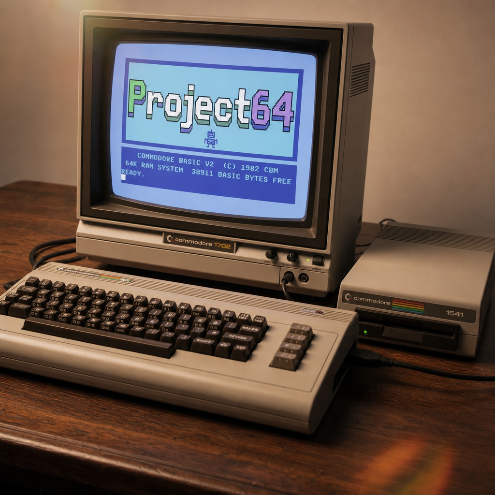

# Project64

Project64 is a set of tools, skills, and an MCP to enable agentic Commodore
64 coding and debugging using the VICE emulator.

> The Python package is imported as `c64lib`, installed as `c64-tools`, and
> driven by the `c64` command-line tool.

## Install

Requires **Python 3.11+**, **VICE 3.5+** (provides `x64sc` and `petcat`), and
the **cc65** suite (`ca65`/`ld65`, for assembling 6502 programs). Then install
this package.

macOS (Homebrew):

    brew install vice cc65
    pip install -e .

Debian / Ubuntu:

    sudo apt install vice cc65
    pip install -e .

## Quickstart

    pip install -e .
    c64 session start --model c64      # boot an emulated C64 (NTSC)
    c64 run tests/programs/hello-basic/program.bas   # tokenize + load + RUN
    c64 run tests/programs/hello-asm/program.s       # assemble + load + RUN (needs cc65)
    c64 screen                             # read the screen as text
    c64 basic type prog.bas --run          # type a program via the keyboard
    c64 mem read '$0400' 64                # hex dump of screen RAM
    c64 break add start                    # symbolic breakpoint (uses .lbl symbols)
    c64 wait --break                       # block until it fires
    c64 step 5 && c64 reg                  # single-step, inspect (PC annotated)
    c64 continue                           # resume
    c64 disk create work.d64 && c64 disk put work.d64 game.prg game
    c64 session start --disk work.d64      # boot with the disk attached
    c64 disk boot work.d64                 # or attach+run mid-session
    c64 build game.s --area 'HIGH=$4000:$2000'   # link a segment at a fixed address
    c64 package game.s -o game.crt         # build a bootable cartridge
    c64 cart verify game.crt               # catch the silent no-boot cases
    c64 run game.crt                       # reboot the session with it mapped
    c64 rom info                           # identify the loaded ROM set
    c64 rom disasm CHROUT 16               # annotated live disassembly
    c64 session stop

    c64 test run mytest.yaml               # declarative YAML test (format in docs/cli.md)
    c64 test programs                      # run every example program as a test

Every command takes `--json` for machine-readable output — the intended
interface for AI agents.

## Documentation

| Reference | What's in it |
|---|---|
| **[docs/cli.md](docs/cli.md)** | The complete `c64` command reference — one entry per command, every flag, and the `*.yaml` test and disk-manifest formats. |
| **[docs/mcp.md](docs/mcp.md)** | The CLI↔MCP map: which tool twins which command. Each MCP tool describes itself, so this page maps rather than repeats. |
| **[docs/agent-setup.md](docs/agent-setup.md)** | The two integration routes, with config for Claude Code, Codex, Cursor, Gemini CLI, Antigravity, and Crush. |
| **[docs/graphics-and-sprites.md](docs/graphics-and-sprites.md)** | What demos may use, how sprite and graphic data is authored, and what a test may assert about pixels. |

Domain knowledge — C64 memory maps, KERNAL routines, 6502 idioms, and a
cookbook of working recipes — lives in [`skills/`](skills/), written to be
loaded by an agent rather than read start to finish.

## Supported machines

Every session boots a Commodore 64 (`--model`, default `c64`). The two
profiles differ only in video standard — pick PAL when timing against
50 Hz software:

| Model | RAM | Free at boot | BASIC | Screen | Notes |
|-------|-----|--------------|-------|--------|-------|
| `c64` | 64 KB | 38911 bytes | 2.0 | 40×25 | **The default.** NTSC (60 Hz); what the demos use. |
| `c64pal` | 64 KB | 38911 bytes | 2.0 | 40×25 | PAL (50 Hz) — different frame rate and slightly different CPU clock. |

The screen is memory-mapped at `$0400` (the power-on default; the VIC-II
can relocate it); "free at boot" is what BASIC reports, and is the budget
a BASIC program (or a `SYS`-stub assembly program) actually has to fit in.

## Using with AI coding agents

This toolset is built to be driven by an AI agent — every `c64` command
takes `--json`, the `c64-tools-mcp` MCP server exposes the same operations,
and debugging state (a breakpoint halt) persists across the agent's tool
calls. See **[docs/agent-setup.md](docs/agent-setup.md)** for the two
integration routes and step-by-step setup for Claude Code, OpenAI Codex,
Cursor, Gemini CLI, Google Antigravity, and Crush.

## Demos — try it with your AI agent

[`demos/`](demos/) is a set of ready-to-run prompts in three tiers.
[Setup your agent](docs/agent-setup.md), give it a demo's `PROMPT.md`, and
watch it write, run, and debug real C64 software on the emulated machine.

**Test demos** — graded exercises; start at 01 if you're new:

| # | Demo | Language | Description |
|---|------|----------|-------------|
| 01 | [Guess the number](demos/01-guess-the-number/) | BASIC | A number game played to a win — the write→run→verify loop |
| 02 | [Bouncing ball (sprite)](demos/02-bouncing-ball/) | BASIC | A multicolor sprite bounced off all four borders, proved from the VIC-II registers |
| 03 | [Sieve benchmark](demos/03-sieve-benchmark/) | BASIC + asm | The sieve written twice and timed off the jiffy clock — the asm speedup, then optimized |
| 04 | [Debug hunt](demos/04-debug-hunt/) | BASIC + debugger | A dashboard broken in three layers, found with breakpoints and stepping |
| 05 | [Bach's Invention No. 13](demos/05-bach-invention/) | BASIC | A two-part invention on voices 1 and 2, noise percussion on voice 3 — proved by audio capture, a reference score, and a piano roll |

**Game demos** — complete builds with sprites, custom charsets, and
three-voice SID sound:

| Demo | Language | Description | Screens |
|------|----------|-------------|---------|
| [Snake](demos/snake/) — [▶ Play](https://nschneir.github.io/Project64/play.html?demo=snake) | 6502 assembly | Arcade Snake on a custom hires charset — held-key steering read off the keyboard matrix, SID sound, nine speeding-up levels | 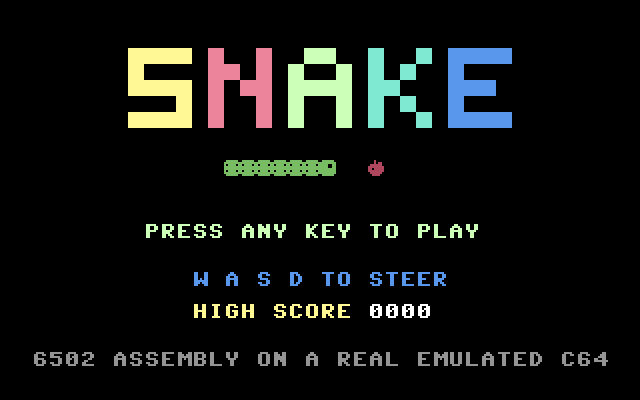 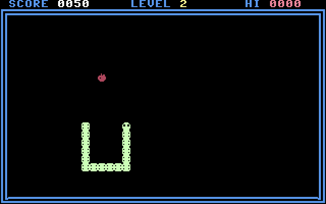 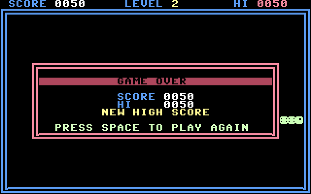 |
| [Invaders](demos/invaders/) — [▶ Play](https://nschneir.github.io/Project64/play.html?demo=invaders) | 6502 assembly | The 1978 arcade original — sprites and custom charset, the one-invader-per-tick march, 3-voice SID | 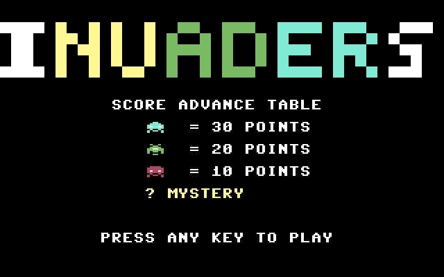 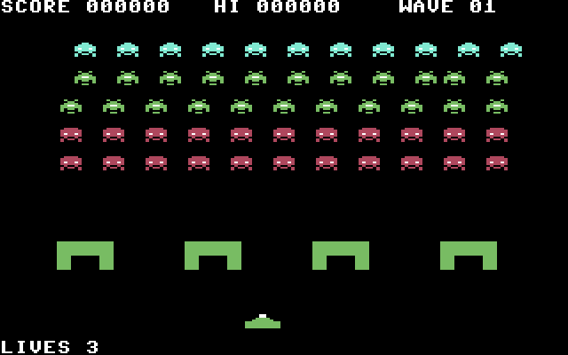 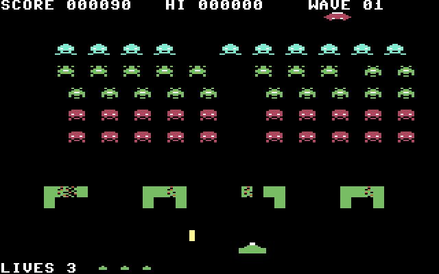 |
| [Ms. Muncher](demos/ms-muncher/) — [▶ Play](https://nschneir.github.io/Project64/play.html?demo=ms-muncher) | 6502 assembly | A maze chase — four rotating mazes, per-ghost targeting AI, six sprites, animated cut scenes |   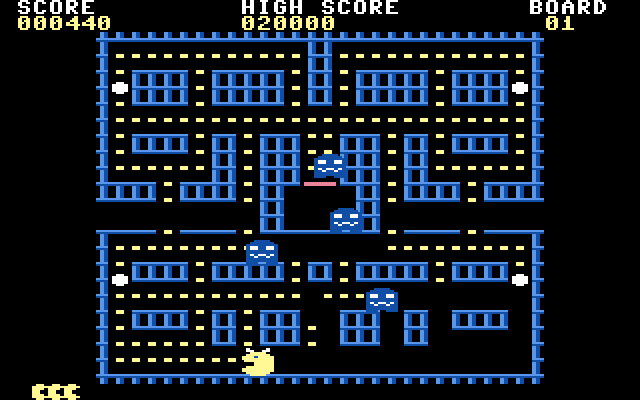 |
| [La Galaxia](demos/la-galaxia/) — [▶ Play](https://nschneir.github.io/Project64/play.html?demo=la-galaxia) | 6502 assembly | An old school shooter in Spanish with a deliberately off-kilter sound track — a 40-enemy formation in character RAM and raster-IRQ sprite multiplexing | 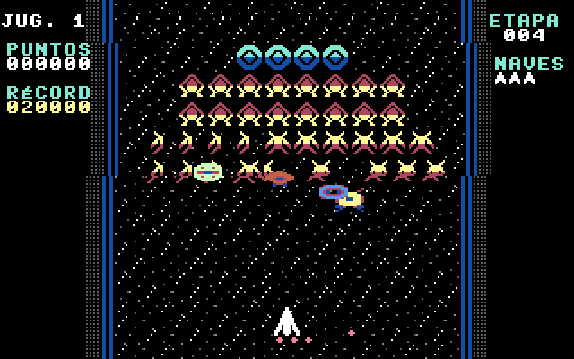 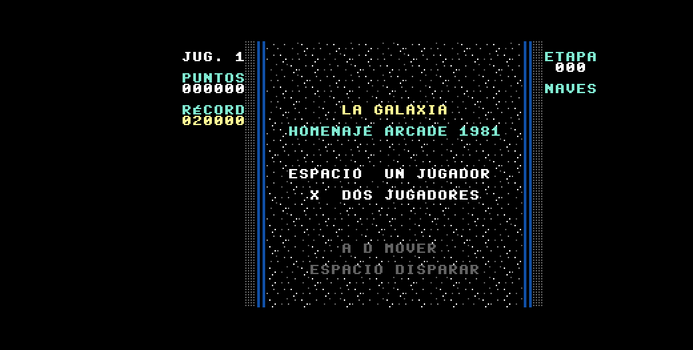 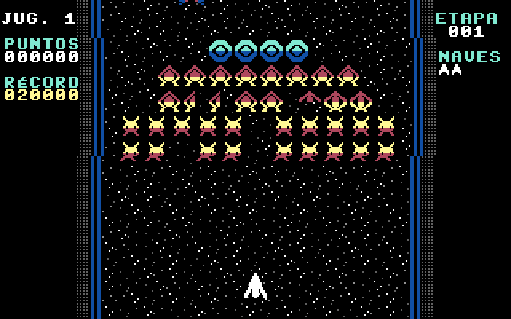 |

**Miscellaneous cool stuff**:

| Demo | Language | Description | Screens |
|------|----------|-------------|---------|
| [1812](demos/1812/) — [▶ Play](https://nschneir.github.io/Project64/play.html?demo=1812) | 6502 assembly | Shapes painted to Tchaikovsky's *1812 Overture* — bitmap mode, a rotating polygon rasterizer, 3-voice SID | 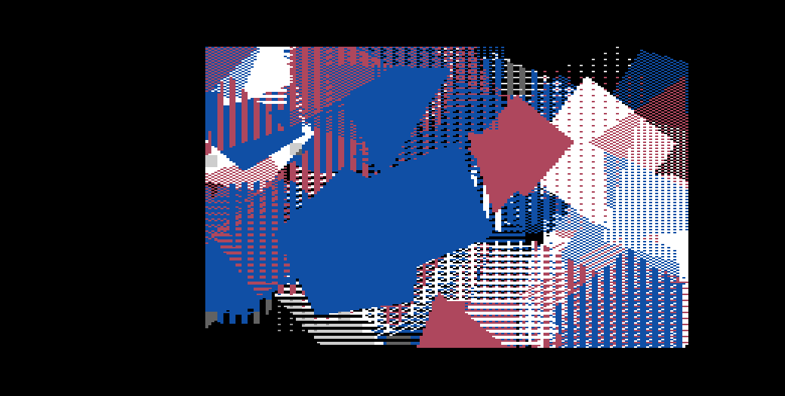 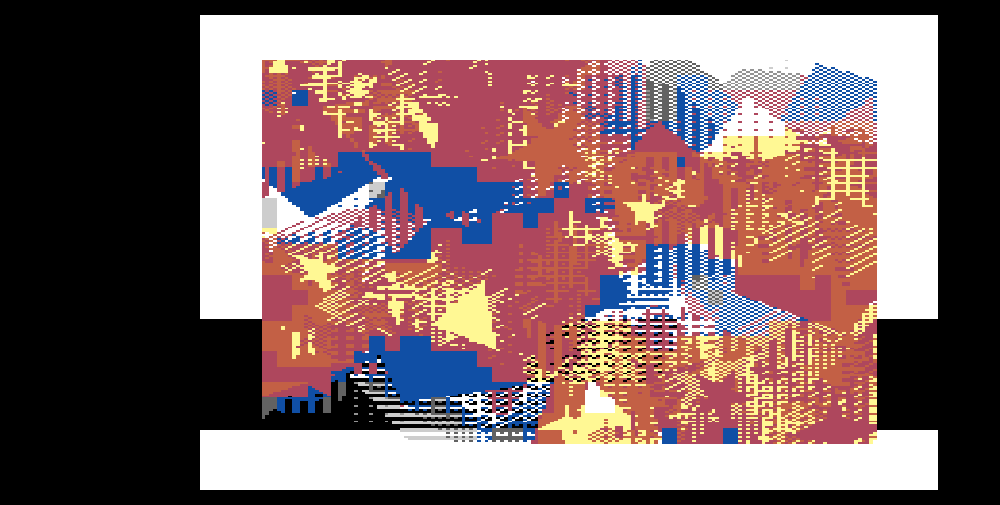 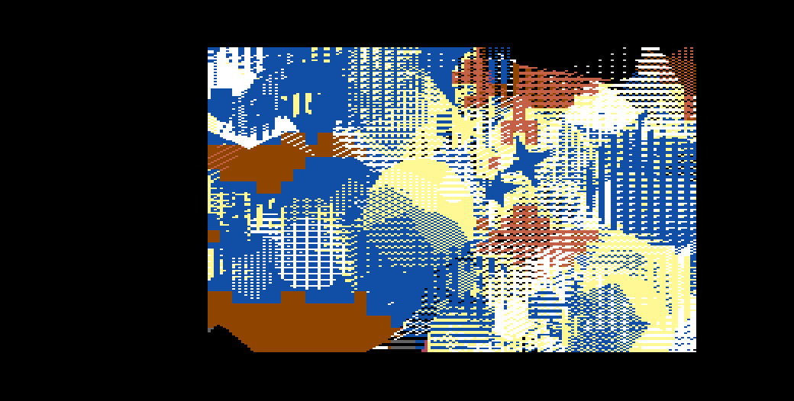 |
| [Fugue No. 2 in C Minor](demos/fugue/) | 6502 assembly | Bach's BWV 847 on three SID voices while its score scrolls past — custom charset staves, pitch-class note colors, a sprite backlighting the sounding note | &nbsp; |

Every demo outside the test tier keeps its whole solution once it has been
built: the sources an agent wrote, a fidelity audit, a regression test, and
a runnable disk. All five are in
[`demos/`](demos/) — `x64sc -ntsc demos/invaders/invaders.d64` and play it
with A/D and space, `x64sc -ntsc demos/snake/snake.d64` and play it with
W/A/S/D, `x64sc -ntsc demos/ms-muncher/ms-muncher.d64` and play that with
W/A/S/D too, `x64sc -ntsc demos/la-galaxia/la-galaxia.d64` and play that with
A/D and space, or `x64sc -ntsc demos/1812/1812.d64` and just watch. Their
audits are [invaders](demos/invaders/AUDIT.md), [snake](demos/snake/AUDIT.md),
[ms-muncher](demos/ms-muncher/AUDIT.md),
[la-galaxia](demos/la-galaxia/AUDIT.md) and [1812](demos/1812/AUDIT.md).
Fugue is prompt-only so far.

All five built demos also run in the browser: the ▶ Play links above, or all
of them together at
[play.html](https://nschneir.github.io/Project64/play.html). Browser play is
powered by
[vc64web](https://vc64web.github.io) — mithrendal's WebAssembly port of
Dirk W. Hoffmann's [VirtualC64](https://github.com/dirkwhoffmann/virtualC64) —
loaded at runtime from a maintainer-owned fork, not bundled with this project.
It boots each demo's `.prg` on the MEGA65
[open-roms](https://github.com/MEGA65/open-roms) KERNAL, BASIC and character
ROMs — Paul Gardner-Stephen and Roman Standzikowski's free/libre
re-implementation, LGPL-3.0-or-later, with parts of BASIC additionally
MIT © Microsoft and the PXL character font by Retrofan — so no Commodore ROM
is hosted here or sent to your browser.

The reference example programs (with expected screen output, runnable as
regression tests via `c64 test programs`) live in
[`tests/programs/`](tests/programs/).

## Sharing what you built

`c64 package` turns a source file into something any VICE user can run — no
c64-tools needed on their end:

    c64 package snake.s -o snake.d64 --title SNAKE

That assembles the program and writes it as the first file on a fresh disk
image, so it autostarts. The recipient just needs VICE installed:

    x64sc -ntsc snake.d64    # boots a C64, runs SNAKE

(`c64 package` prints this exact command; both profiles pin their video
standard — `-ntsc` / `-pal` — since stock x64sc boots its own default
machine and timing differs.) The bare `.prg` (also produced) works too, as
does VICE's
File → Smart attach. Disk images travel better: they carry a real CBM
directory, so `LOAD"SNAKE",8` then `RUN` works the old-fashioned way.
Neither artifact contains ROMs or anything from this toolset.

## Disk images

`c64 disk` manipulates `.d64`/`.d71`/`.d81` images through VICE's `c1541` —
all of it offline, with no session and no emulator running (only
`c64 disk boot` touches a live machine):

    c64 disk build game.disk.yaml          # a whole disk from a manifest
    c64 disk ls game.d64                   # directory listing + blocks free
    c64 disk put game.d64 level1.bin       # copy a host file in
    c64 disk rename game.d64 old new       # rename a file in place
    c64 disk rm game.d64 "lvl*"            # scratch, CBM wildcards and all
    c64 disk validate game.d64             # the CBM fsck; rewrites the BAM
    c64 disk block read game.d64 18 0      # a raw sector (18/0 is the BAM)
    c64 disk boot game.d64                 # attach + LOAD/RUN the first file

A `*.disk.yaml` manifest is the reproducible way to ship a multi-file game:
list the sources in load order and `c64 disk build` assembles `.s` entries,
tokenizes `.bas`, and copies everything else verbatim onto a fresh image whose
first file autostarts. A manifest that would overflow the disk — on blocks or
on directory entries — is refused before the image is formatted, so a build
that cannot fit writes nothing at all.

c1541 exits 0 on a surprising number of failures (a rename of a file that
isn't there, a scratch that matched nothing, a sector poke running off the end
of a sector), so these commands judge success from the DOS status line and the
resulting image rather than from the exit code alone. `c64 disk validate` is
the exception that proves it: a DOS error there describes the *image*, so it
is reported in the result rather than raised.

Full command reference: [docs/cli.md](docs/cli.md#disk-images); the MCP twins
of these commands are mapped in [docs/mcp.md](docs/mcp.md#disk-images). The
`disk-io-programming` skill covers the runtime half — the KERNAL `LOAD`/`SAVE`
and channel calls, and the secondary address that decides where a file lands.

## Cartridges

A cartridge is ROM the machine maps at power-on: it boots itself, so there is
no load address, no `READY.` prompt, and no error message when it is wrong —
a broken image just boots to BASIC without a word.

    c64 package game.s -o game.crt --cart-type 8k   # 8k / 16k / ultimax
    c64 package game.bas -o game.crt                # wrap an existing program
    c64 cart build game.ef.yaml                     # multi-bank EasyFlash
    c64 cart verify game.crt                        # before every boot
    c64 run game.crt                                # boot a session with it mapped

`c64 cart verify` is the one to reach for first: it catches the failures that
are silent on hardware (a missing CBM80 signature, a vector pointing outside
the cartridge, an EasyFlash image with no boot window) without an emulator
round trip. The rest of the `c64 cart` group decodes a container (`info`),
extracts a bank window for offline disassembly (`dump`), reports live EasyFlash
banking on the running machine (`bank`), and shells out to VICE's `cartconv`
for types this tool does not model natively (`convert`). Recipients need only
stock VICE: `x64sc -ntsc -cartcrt game.crt`.

Full command reference: [docs/cli.md](docs/cli.md#cartridges); the MCP twins
of these commands are mapped in [docs/mcp.md](docs/mcp.md#cartridges). The
`cartridge-programming` skill covers the boot mechanisms, the memory modes,
and the EasyFlash banking discipline.

## Status

Stable — current release **v0.9.5**. Full history: [CHANGELOG.md](CHANGELOG.md).

## AI Disclosure

Project64 is developed primarily by AI — Anthropic's Claude, working
through Claude Code — under human direction: a human sets the goals,
reviews the designs and plans, and approves the work; the AI writes the
specs, plans, code, tests, and documentation. Every change is verified by
the automated test suite, including integration tests that run against a
real VICE emulator, before it lands. The project also exists *for* AI use —
these tools are built so AI agents can write and debug Commodore 64
software — making it a working example of AI-built developer tooling.

## License

MIT license. Note that VICE is a separate GPLv2+ program invoked as a
subprocess; it is not bundled and must be installed separately.

ROM tooling reads ROM bytes from your running emulator and ships only
original label annotations — no Commodore-copyrighted code lives in this repo.
