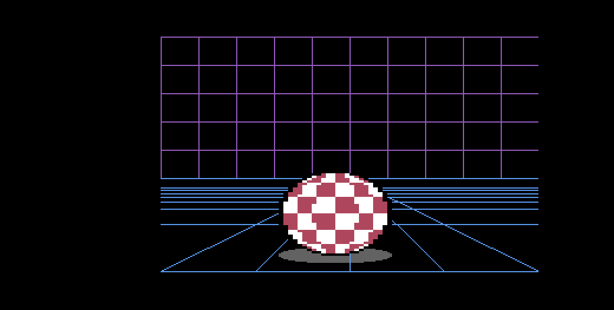
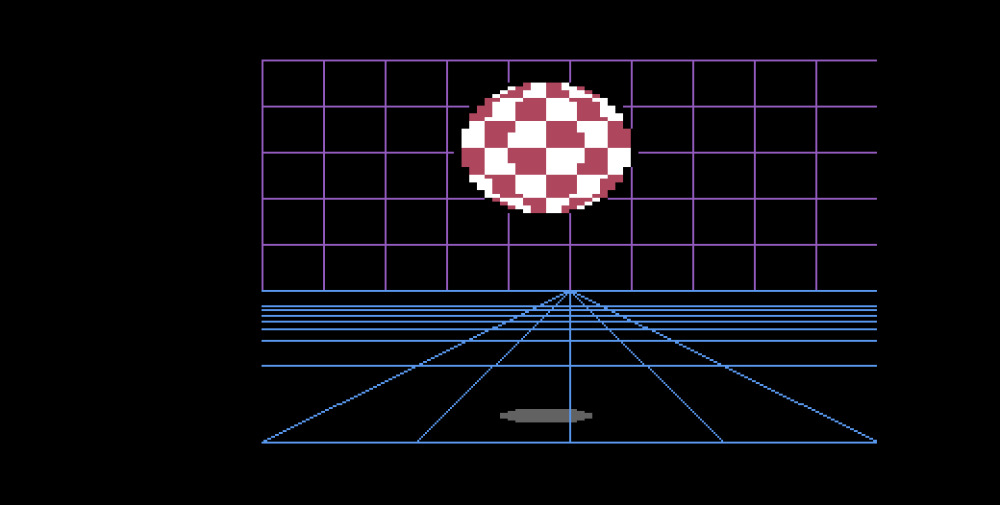

# Amiga Ball

The 1984 Amiga **Boing Ball** — the checkered sphere Commodore bounced across a
purple wire grid at CES — rebuilt on a Commodore 64 in pure 6502 assembly. Four
multicolor hardware sprites carry a genuinely texture-mapped sphere through 16
precomputed rotation frames, over a custom-charset room with a real perspective
floor, with a shrinking contact shadow and a synthesised boing that is a
different sound off the floor than off a wall.

`PROMPT.md` started life as a detailed prompt written by a human; Claude helped
draft it into its present shape, and a human edited the result. Every other file
here — the spec, the plan, the sources, the generators, the fidelity audit, the
regression test, the evidence frames, the audio captures, and the packaged disk
— was written by Claude Opus 5 in answer to that prompt.




## Watch it

`amiga_ball.d64` sits beside the sources, so stock VICE is all you need:

```sh
x64sc -ntsc demos/amiga_ball/amiga_ball.d64
```

The `-ntsc` flag matters more here than in most of these demos. The bounce
table is 64 entries of an exact parabola written for a **60 Hz** frame, and the
ball's 96 × 72 shape is sized for NTSC's 0.7435 pixel aspect ratio. Stock VICE
boots the PAL machine given no flag, and there the same program runs **16.7%
slower** (a bounce takes 1.28 s instead of 1.07 s) and the ball comes out
**25% wider than it is tall** — `96 × 0.936 / 72 = 1.25` — which is a squashed
disc rather than a sphere. To rebuild the image (and the `.prg` beside it) from
source:

```sh
c64 package demos/amiga_ball/amiga_ball.s -o demos/amiga_ball/amiga_ball.d64 \
    --title "AMIGA BALL" \
    --area 'CHARS=$2000:$0800' --area 'SPRITES=$2800:$1800' --area 'VARS=$4000:$0100'
```

Those three `--area` flags are not optional decoration — they are the memory
map. The charset has to sit on a 2 KB boundary the VIC can see, the sprite
blocks on their 64-byte ones, and the observable state at a *fixed* address so
`c64 audio capture --at-frame` can name it.

**Controls.** None. The ball bounces, spins, and reverses its spin at each side
wall on its own; the main loop's only job is to increment a byte proving it is
still alive under the interrupt.

## What is here

| File | |
|---|---|
| `PROMPT.md` | the human-directed, Claude-assisted prompt everything else answers |
| `SPEC.md` | the design, with the arithmetic pinned and cited — and 28 acceptance criteria |
| `PLAN.md` | the implementation plan written before any code |
| `AUDIT.md` | the fidelity audit — every criterion, with evidence off the running machine |
| `amiga_ball.s` | load address, BASIC stub, equates, init, the raster IRQ, `tick`, main loop |
| `vars.s` | every observable byte, at fixed addresses, in the order `SPEC.md` §9 lists them |
| `ball.s` | physics, impacts, rotation index, shadow band, and every sprite register write |
| `room.s` | charset install, screen-matrix copy, colour RAM |
| `sound.s` | the two-voice impact synth, and `sidput` — the one routine that writes the SID |
| `sprites.inc` | *generated* — 16 rotation frames, 4 blocks each, 4,096 bytes |
| `shadow.inc` | *generated* — four shrinking contact-shadow shapes |
| `chars.inc` + `screen.inc` | *generated* — the 256-glyph charset and the 1,000-byte room |
| `bounce.inc` | *generated* — the 8.8 parabola, exact in fixed point |
| `sound.inc` | *generated* — the two filter-cutoff ramps |
| `tools/generate.py` | runs all five generators; the `.inc` files must come back byte-identical |
| `tools/score.py` | writes the reference scores from the demo's own impact schedule |
| `tools/evidence.sh` | re-runs the deterministic proof protocol and rewrites `evidence/` |
| `tools/audio-evidence.sh` | the two real-time audio captures, which cost wall clock |
| `test.yaml` | the regression spec: `c64 test run demos/amiga_ball/test.yaml` |
| `evidence/` | 15 PNGs and 12 state dumps — every visual claim, with the bytes that produced it |
| `evidence/audio/` | floor and wall captures, five artifacts each |
| `amiga_ball.d64` | the packaged disk image, autostartable in stock VICE |
| `amiga_ball.prg` | the assembled program `c64 package` writes beside the image |

## What a passing run shows

A ball that is **round** — measured, not judged: the sphere's bounding box is
96 × 72 raster pixels, and `96 × 0.7435 / 72 = 0.991`. A checkerboard that is
really mapped onto a sphere, so its columns compress toward the limb and its
rows toward the poles. Sixteen rotation frames switched by nothing but the four
sprite pointers, reversing direction on the frame a wall is hit. A parabolic
bounce whose every frame has an exact documented Y, a shadow that shrinks
through four shapes as the ball climbs and that the floor's grid lines are drawn
*over*, and an impact that is audibly lower off the floor than off a wall.

Then the proof: 167 regression steps green, 15 evidence PNGs that are
byte-identical across two runs from a cold session, two audio captures whose
reports pass against scores generated from the impact schedule rather than
fitted to the recording, and a written audit marking all 28 criteria with the
command and output that settled each one.

The per-frame job costs **7 raster lines** of a 263-line frame. It is armed at
line 10 and finishes inside the top border, before the VIC draws a single pixel
of the display — so there is no tearing to look for, and the margin is not an
estimate but a `c64 profile tick` reading of 481 cycles.

## The bits worth reading

**`tools/gen_sprites.py`, and why there are 16 frames.** The ball's checker is
16 longitude segments by 8 latitude bands, and parity is `(lon + lat) & 1`.
Rotate that by one segment and every segment lands on its neighbour, whose
parity is opposite — so the image is colour-*inverted*. Rotate by **two** and it
is identical. The rotation period of this texture is therefore **45°, not
360°**, which is the whole reason a full visual cycle fits in 4,096 bytes
instead of 32,768. Everything else about the memory map follows from that one
observation.

**`ball.s`'s `$D010` rebuild.** The X-MSB is recomputed from scratch every
frame rather than read-modify-written. It takes exactly two values here — `$00`,
or `$2A` once the ball's left edge passes 208 — and a stale one is not a subtle
artifact but a ball that teleports 256 pixels sideways.

**`SPEC.md`, as a record of being wrong.** Nine of its numbers were corrected by
the machine during the build, each with the measurement that overturned it: the
sphere's centre was the texel-index centre rather than the block's continuous
centre; the bounce table disagreed with its own formula at four of nine points
and betrayed itself by implying two different amplitudes; the shadow's heights
were even where an integer centre row forces odd; and a sprite whose Y register
is V turns out to display its first row on raster **V+1**, which moved every
raster figure in two sections. The document is more useful for having those
corrections in it than it would be if it had been quietly right.
