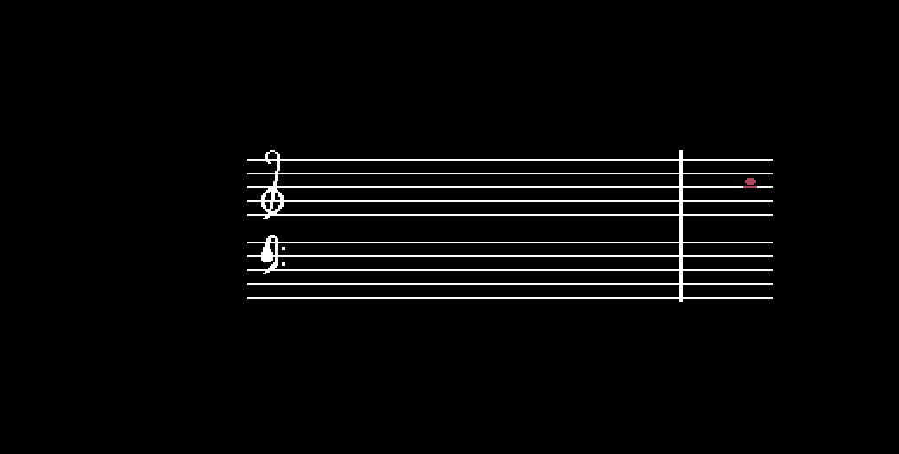
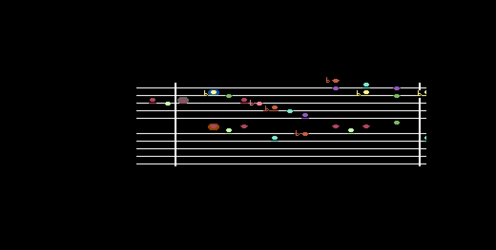

# Fugue No. 2 in C Minor

J. S. Bach's Fugue No. 2 in C minor, BWV 847, from *The Well-Tempered
Clavier* Book I — all 31 bars played on the SID while the notated score
scrolls across a custom-charset grand staff, in time with the music.

The piece is chosen for the hardware rather than in spite of it. BWV 847 is a
**three-voice fugue** and the SID has exactly three voices, so nothing has to
be dropped or merged to make it fit: the subject goes to voice 1 as a pulse
wave with pulse-width modulation, the countersubject to voice 2 as a sawtooth,
and the bass to voice 3 as a triangle through the resonant filter.

`PROMPT.md` started life as a detailed prompt written by a human; Claude
helped draft it into its present shape, and a human edited the result. Every
other file here — the arrangement, the sources, the spec and plan they were
built from, the four-iteration audit, the 128-step regression test, the
evidence, and the packaged disk — was written by Claude Opus 5 in answer to
that prompt.




## Play it

`fugue.d64` sits beside the sources, so stock VICE is all you need:

```sh
x64sc -ntsc demos/fugue/fugue.d64
```

The `-ntsc` flag matters more here than in most demos. Everything is timed in
frames — the scroll, the sequencer, and the tempo that ties them together — so
on a 50 Hz PAL machine the fugue plays at 93.75 BPM instead of 112.5. (The
*tuning* survives the move: `init` reads `$02A6` and picks a note table built
for whichever machine it is on, so a PAL run is slow but not 65 cents flat.)

There are no controls. It plays once, 66 seconds, and stops. To rebuild the
image and the `.prg` beside it:

```sh
c64 package demos/fugue/fugue.s -o demos/fugue/fugue.d64 --title "FUGUE IN C MINOR" \
    --area 'CHARS=$2000:$0800' --area 'SPRITES=$2800:$0100'
```

## What is here

| File | |
|---|---|
| `PROMPT.md` | the human-directed, Claude-assisted prompt everything else answers |
| `SPEC.md` | the design, every decision with the fact it rests on |
| `PLAN.md` | the implementation plan, with what the running machine corrected recorded inline |
| `AUDIT.md` | the four-iteration audit — every criterion, with evidence |
| `fugue.s` | load address, BASIC stub, equates, `init`, the IRQ, `tick`, includes |
| `vars.s` | every mutable byte, with the labels the tests read |
| `staff.s` | the grand staff and `drawcol`, the column renderer |
| `scroll.s` | the 1,200-byte column shift under the `$D016` fine scroll |
| `music.s` | the sequencer, the SID writes, the shadow, PWM and the filter sweep |
| `glow.s` | the three backlight sprites |
| `chars.inc` | 48 generated glyphs — heads, accidentals, bar lines, two clefs |
| `sprites.inc` | the generated glow shape |
| `notes.inc` | 1,488 bytes of note data plus the position, colour and frequency tables |
| `tools/bwv847.py` | **the arrangement**, as note names, with mechanical self-checks |
| `tools/genmusic.py` | `bwv847.py` → `notes.inc`, the histogram, the colour table |
| `tools/genscore.py` | `bwv847.py` → reference scores, and the window alignment |
| `tools/crosscheck.py` | the screen-versus-sequencer check |
| `tools/charset.txt` `tools/glow.txt` | the ASCII sheets the graphic data is authored as |
| `tools/evidence.sh` | regenerates every screenshot in one command |
| `tools/audio-evidence.sh` | regenerates the four captures, `--strict` |
| `test.yaml` | 128-step regression test: `c64 test run demos/fugue/test.yaml` |
| `evidence/` | the screenshots and the four audio captures |
| `fugue.d64` `fugue.prg` | the packaged disk and the program beside it |

## What a passing run shows

Four seconds of stillness — the grand staff, both clefs, the first bar line —
then the score begins to move and the alto states the subject. The answer
arrives in the soprano, the bass enters last, and for 66 seconds the notes
travel right to left toward a fixed "now" column, each head coloured for its
pitch class and each altered note carrying its own flat or sharp. Three
sprites sit *behind* the sounding heads so they read as backlit. Through the
closing pedal the filter closes down and opens again, and the fugue ends on a
Picardy third held at the now column with the scroll stopped.

Then: 128 test steps green, nine evidence frames, four audio captures whose
reports all pass against reference scores written from the arrangement's own
note data, and a `.d64` that autostarts in stock VICE.

## The bit worth reading

`fugue.s`, the twelve lines that derive everything from one counter:

```
$D016 fine scroll = 6 - 2*(sf & 3)      two pixels of travel a frame
column shift      when (sf & 3) == 0    eight pixels every four frames
note attack       when (sf & 7) == 0    sixteen pixels a sixteenth
```

One sixteenth note is two character columns and eight frames, so **the scroll
offset counter *is* the sixteenth-note subdivision counter**. Picture and
music cannot drift apart, because there is one counter and both read it. The
same economy runs through the data: one byte per voice per sixteenth carries
the staff position, the accidental and the head shape, and the *sounding
pitch* is that byte read a second way — `posmidi[p]` adjusted by the
accidental. There is no separate pitch stream that could disagree with the
drawn one, which is what makes `tools/crosscheck.py` worth running rather than
circular.

And `scroll.s`, for the opposite reason — because the obvious approach does
not fit and the arithmetic says so before any code does. Shifting 15 rows of
screen and colour RAM is 1,200 byte-moves, at least 18 cycles a cell, so
10,800 cycles minimum out of a 17,095-cycle frame. Armed in the top border as
the cookbook advises, that cannot make the deadline, and no tuning would have
saved it. What does is a fact about the VIC: once it has latched a text row's
matrix and colour on that row's badline, later writes cannot affect the
current frame — so the shift may begin the instant the *last* band row has
latched, at raster 203, and use the bottom border and the top border together.
263 raster lines instead of 215. The program then publishes `tickend`, the
high-water raster at the tick's exit, so the claim is measured rather than
argued: **178, against a deadline of 203.**
