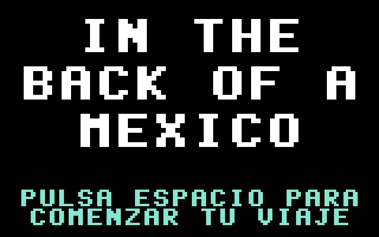

# La Galaxia

A fixed shooter for the Commodore 64, chasing the 1981 arcade original named
in the prompt as closely as the hardware allows — the full 40-enemy formation
on eight hardware sprites, five scripted entrance waves off trajectory lookup
tables, the tractor beam that steals your fighter and the mid-flight rescue
that gives you two, transforming enemies, the no-fire challenging stages with
their 10,000 point bonus, and a three-voice SID score that ducks under the
effects. Every string the player sees is Spanish — `PUNTOS`, `RÉCORD`,
`NAVES`, `ETAPA`, `¡PERFECTO!`, `JUEGO TERMINADO` — except the cold open,
which is the narrator rather than the cabinet.

`PROMPT.md` started life as a detailed prompt written by a human; Claude
helped draft it into its present shape, and a human edited the result. Every
other file here — the sources, the plan they were built from, the fidelity
audit, the regression test, the evidence frames, the audio captures and the
packaged disk — was written by Claude in answer to that prompt.




## Play it

`la-galaxia.d64` sits beside the sources, so stock VICE is all you need:

```sh
x64sc -ntsc demos/la-galaxia/la-galaxia.d64
```

The `-ntsc` flag matters: given no video-standard flag, stock VICE boots the
PAL machine, and this game was built and timed on the NTSC machine c64-tools
boots by default. To rebuild the image (and the `.prg` beside it) from source:

```sh
c64 package demos/la-galaxia/la-galaxia.s -o demos/la-galaxia/la-galaxia.d64 \
    --title "LA GALAXIA" --area 'ENGINE=$4000:$6000'
```

The `--area` is not optional: the engine is linked at `$4000` so the whole of
`$2000-$3FFF` can be sprite shapes and character set, and the fill below it is
what blanks that region before startup writes the art into it. `c64 run` and
a `test.yaml` both take it now — `c64 run demos/la-galaxia/la-galaxia.s
--area 'ENGINE=$4000:$6000'` builds and runs the game in one command, and the
regression spec assembles the same way through its `areas:` key — so
`tools/build.sh` is the debugging cycle (load with symbols, nothing running
yet) rather than the only way in.

**Controls.** `A` and `D` move, `SPACE` fires. `SPACE` also starts a
one-player game and `X` starts two. Input is read three ways and folded into
one byte — the keyboard matrix scanned directly, `$CB` for the current held
key, and joystick port 2 — so a player can move and fire in the same frame.

Function keys are deliberately not used: `F1`/`F3` are the obvious mapping of
the arcade's start buttons and were the first choice here, but they do not
survive the trip from a Mac keyboard through VICE's keymap.

## The hidden keys

On the title screen only, the digit keys start a one-player game at a chosen
stage: `1` through `9` for stages 1-9, and `0` for stage 10. They grant the
stage and nothing else — the score starts at zero, the lives at three, and you
begin as a single fighter.

They exist so a reviewer can reach the first challenging stage (`3`) and the
transforming enemies (`4`) without playing there first, and they are how most
of the frames in `evidence/` were captured. `AUDIT.md` is required to list
them, and does.

## What is here

| File | |
|---|---|
| `PROMPT.md` | the human-directed, Claude-assisted prompt everything else answers |
| `PLAN.md` | the implementation plan written before any code, with the revision log of every place the running machine corrected it |
| `AUDIT.md` | the five-iteration fidelity audit — every claim, with the measurement that settles it |
| `la-galaxia.s` | load address, BASIC stub, equates, startup, the frame anchor, the state machine, includes |
| `vars.s` | every mutable byte, with the labels the tests and the evidence read |
| `cold.s` | the cold open: a hires bitmap over the sprite blocks, and the step machine that puts the art back |
| `screen.s` | row tables, the cell pointer, text without CHROUT, the bezel, the background shadow |
| `chars.s` + `chars.inc` | the character set installer and the original glyphs |
| `sprites.s` + `sprites.inc` | the shape fan-out and the stored art |
| `mux.s` | the Y-sort, the raster event chain, `mux_count`/`mux_overflow` |
| `stars.s` | the three-layer parallax starfield, scrolled by rotating glyph bitmaps |
| `formation.s` | the 40-slot grid in character RAM, the breathing, the sprite handoff |
| `waves.s` + `traj.inc` | the entrance waves and the trajectory LUT player |
| `enemy.s` | the per-frame enemy update, dives, escorts, transforms, the beam |
| `player.s` | the three input decoders, the fighter, the capture, the Dual Fighter |
| `shots.s` | player missiles and enemy bullets, in character space |
| `collide.s` | coordinate collision — the grid, the divers, the beam — and the score table |
| `stage.s` | stage flow, the difficulty tiers, the challenging stages |
| `hud.s` | `PUNTOS`, `RÉCORD`, `NAVES`, `ETAPA`, the panels, the extra lives |
| `title.s` | the attract screen and the hidden stage-select keys |
| `sound.s` | three SID voices, priority-claimed, every write shadowed |
| `text.inc` | every string, as screen codes |
| `test.yaml` | the deterministic regression spec: `c64 test run demos/la-galaxia/test.yaml` — assembled from source on every run through its `areas:` key |
| `tools/build.sh` | build with `--area` and load with symbols: the debugging cycle, where nothing is running yet |
| `tools/charset.txt` `punct.txt` `glyphs.txt` | ASCII-art glyph sheets → `chars.inc` |
| `tools/enemies.txt` + `genblocks.py` | 16×16 enemy pictures split into the 8×8 quadrants the screen matrix needs |
| `tools/sprites.txt` | every sprite shape, named and commented, read as authored by `c64 sprite encode --background .` |
| `tools/gentraj.py` | velocity tables and flight paths → `traj.inc`, with the checks that keep a path on the map |
| `tools/genmusic.py` | the score source → `music.inc` **and** its reference score YAML |
| `tools/genart.sh` | regenerates `chars.inc` and `sprites.inc` from the art |
| `tools/evidence.sh` | re-runs the deterministic proof protocol and rewrites `evidence/` |
| `tools/audio-evidence.sh` | re-runs the five audio captures against their reference scores |
| `evidence/` | the frames that protocol captures, one per claim |
| `evidence/audio/` | five captures — the theme's opening, the loop seam, a play volley, the tractor beam, and the priority rule — each with its five artifacts and a passing report |
| `la-galaxia.d64` | the packaged disk image, autostartable in stock VICE |
| `la-galaxia.prg` | the assembled program `c64 package` writes beside the image |

## What a passing run shows

An assembled program with a BASIC SYS stub and the full arcade loop — cold
open → attract screen → entrance waves → dives → challenging stage → game
over → cold open — with the 40-enemy formation settled in character RAM and
every diver handed to a raster-IRQ multiplexer that never overflows, five
scripted entrances off trajectory LUTs, a tractor beam that takes your fighter
and a mid-flight rescue that gives you two, transforming enemies, the no-fire
challenging stages with their `¡PERFECTO!` bonus, and three-voice SID music
that keeps playing under the effects that duck it; then a fidelity audit with
every claim measured, the deterministic evidence trail the prompt calls for,
and a `.d64` that autostarts in stock VICE.

## The bits worth reading

**`mux.s`, and the interrupt that fired itself.** The multiplexer is the
ordinary shape — sort the objects by Y once a frame, give each the first
hardware sprite that has come free, reprogram it from a raster interrupt — and
the interesting part is the bug. When two raster events sit within about three
scanlines, the handler writes the second event's line into `$D012`, finds the
beam already past it, and dispatches inline. But the beam crossing that
just-written compare line *re-latches the interrupt*. The `rti` re-entered
immediately with the event index parked back at zero, so the frame-start event
ran mid-frame: the frame counter double-counted, the next tick ran early in the
same frame, and the whole event list replayed down the screen. It presented as
27,000 cycles that nothing in the tick could account for, and it only ever
appeared in the stage-1 entrance — because it needed a sprite reposition
landing two to four lines above the formation band's foot. A store watchpoint
on the frame counter caught it firing at raster line 150. The fix is one
re-acknowledge of `$D019` on the way out.

**`formation.s`, and why forty enemies cost no sprites.** A settled enemy is
not a sprite at all: it is a 2×2 block of custom characters in the screen
matrix, coloured per cell. An enemy becomes a hardware sprite only at the
instant it breaks formation, and `tosprite`/`togrid` do the erase and the
spawn in a single call each — so no frame can ever observe an enemy as both or
as neither, which is the bug the evidence would otherwise catch. That is the
whole trick behind "surely that is more than eight sprites".

**`AUDIT.md` iteration 4, and the evidence that wasn't.** The prompt asks for
the frame cost to be shown as a coloured band down the border. The first
committed capture of it was adjudicated and rejected: a pixel scan found red on
every renderable scanline, which by the prompt's own criterion is a picture of
a frame overrunning — evidence of a failure, presented as a pass. Three facts
about the toolchain came out of that review, all of them now written into
`tools/evidence.sh`: a screenshot is a rolling scanline buffer rather than a
frame, lines below the beam are arbitrarily stale after a warp phase, and the
NTSC canvas wraps so a healthy band's start appears at the *bottom* of the
image. The band survives as illustration behind a flag that ships switched
off; the claim itself is now `tick_overrun`, a byte the regression spec reads.
