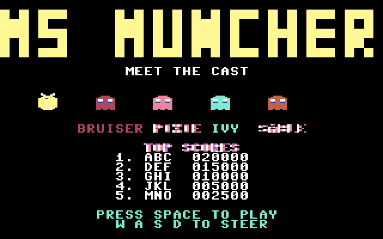
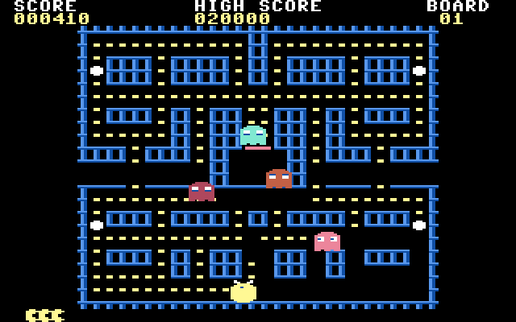

# Ms. Muncher

An arcade-faithful maze chase for the Commodore 64, in pure 6502 assembly —
four rotating mazes on a custom multicolor charset with auto-tiled walls,
six hardware sprites, the arcade's real per-ghost targeting (including the
randomised scatter openings that defeat pattern play), a travelling bonus
fruit, three animated intermission acts, three-voice SID with every write
shadowed, and an explicit audit-and-improve loop that ran until every spec
bullet passed.

`PROMPT.md` started life as a detailed prompt written by a human; Claude
helped draft it into its present shape, and a human edited the result. Every
other file here — the sources, the plan they were built from, the fidelity
audit, the regression test, the evidence frames, the audio captures and the
packaged disk — was written by Claude Opus 5 in answer to that prompt.




## Play it

`ms-muncher.d64` sits beside the sources, so stock VICE is all you need:

```sh
x64sc -ntsc demos/ms-muncher/ms-muncher.d64
```

The `-ntsc` flag matters: given no video-standard flag, stock VICE boots the
PAL machine, and this game was built and tested on the NTSC machine
c64-tools boots by default. To rebuild the image (and the `.prg` beside it)
from source:

```sh
c64 package demos/ms-muncher/ms-muncher.s -o demos/ms-muncher/ms-muncher.d64 \
    --title "MS MUNCHER"
```

**Controls.** `W`/`A`/`S`/`D` steer, `SPACE` starts a game from the title
and skips an intermission. Input is read from `$CB`, the matrix code of the
key held *right now*, so a held key turns her at the next corner; a turn
entered early is buffered and taken there, and a reversal is instant.
Leave the title alone for a few seconds and the game plays itself.

## The hidden keys

On the title screen only, `1`, `2` and `3` jump straight into intermission
acts 1, 2 and 3 — they meet, the chase, the delivery — returning to the
title when the act ends. They exist so a reviewer can reach the cut scenes
without playing nine boards, and they are how every act screenshot and every
act audio capture in `evidence/` was taken.

## What is here

| File | |
|---|---|
| `PROMPT.md` | the human-directed, Claude-assisted prompt everything else answers |
| `PLAN.md` | the implementation plan written before any code |
| `AUDIT.md` | the three-iteration fidelity audit — every spec bullet, with evidence |
| `ms-muncher.s` | load address, BASIC stub, equates, the frame anchor, the state machine, includes |
| `vars.s` | every mutable byte, with the labels the tests read |
| `screen.s` | row tables, the cell pointer, text without CHROUT |
| `chars.s` + `chars.inc` | the RAM charset installer and the 27 patched glyphs |
| `sprites.s` + `sprites.inc` | the shape compositor and the 27 stored shapes |
| `maze.s` + `mazes.inc` | the four playfields, the wall auto-tiler, eating |
| `actor.s` | the shared movement engine: half-pixel steps on 8.8 speed accumulators |
| `player.s` | `$CB` steering, the turn buffer, collision |
| `ghosts.s` | four personalities, the phase table, the house, fright, the LFSR |
| `fruit.s` | the bonus fruit and its route |
| `hud.s` | score, hi-score, board, lives, the fruit strip |
| `attract.s` | the title screen, the block-font logo, and the demo that plays itself |
| `acts.s` | the three intermission scenes |
| `hiscore.s` | the top five and initials entry |
| `sound.s` | three SID voices, priority-claimed, every write shadowed |
| `test.yaml` | the deterministic regression spec: `c64 test run demos/ms-muncher/test.yaml` |
| `tools/mazes.txt` + `tools/genmaze.py` | ASCII-art mazes → `mazes.inc`, with connectivity and dead-end validation |
| `tools/charset.txt` | ASCII art → `chars.inc` via `c64 charset encode --first-code 96` |
| `tools/sprites.txt` | ASCII art → `sprites.inc` via `c64 sprite encode` |
| `tools/evidence.sh` | re-runs the deterministic proof protocol and rewrites `evidence/` |
| `tools/audio-evidence.sh` | re-runs the five audio captures against their reference scores |
| `evidence/` | the screenshots that protocol captures, one per claim |
| `evidence/audio/` | five captures — title, three acts, and play — each with its five artifacts and a passing report |
| `ms-muncher.d64` | the packaged disk image, autostartable in stock VICE |
| `ms-muncher.prg` | the assembled program `c64 package` writes beside the image |

## What a passing run shows

An assembled program with a BASIC SYS stub and the full arcade loop —
attract screen with a self-playing demo → boards → acts → game over →
high-score entry → attract — with four rotating mazes on an original
multicolor charset, six sprites carrying Ms. Muncher, the four named ghosts
and a travelling fruit, per-personality targeting with randomised scatter
openings so no pattern survives, the speed classes reproduced continuously
and measurably, three real animated cut scenes, and three-voice SID music
and effects; then a fidelity audit in `AUDIT.md` with every spec bullet
marked pass, the deterministic evidence trail the prompt calls for, and an
`ms-muncher.d64` the user can autostart in stock VICE.

## The bits worth reading

**`ghosts.s`, and the bug in `AUDIT.md` iteration 3.** The four ghosts do
not share a chase routine — each computes its own target tile at every
junction, and the arcade's up-quirk (a target computed ahead of an
upward-facing player is displaced sideways too) is reproduced on purpose,
because the maze's geometry grew around it. But the bullet that separates
this game from its predecessor is the *randomised* scatter opening, and for
two iterations it silently did not randomise: the LFSR was seeded from the
variable-clearing loop, so its state was zero — and a shift register at zero
shifts to zero for ever — while the frame tick overwrote its high byte every
frame anyway. Every board opened identically. No screenshot showed it and no
shadow byte could have: the ghosts moved, they scattered, every state byte
was plausible. It took playing the same board three times with the start key
pressed on different frames and diffing the positions.

**`maze.s`, and the wall that isn't stored.** No maze stores any wall art.
A wall cell's glyph is chosen from which of its four neighbours are also
wall — sixteen connectivity shapes, with off-map counting as wall so the
border closes — so the same glyph set draws all four layouts, and a fifth
maze authored in `tools/mazes.txt` would be drawn correctly without touching
the renderer. `tools/genmaze.py` refuses to emit one that has an unreachable
dot, a broken tunnel, or a dead end.

**`actor.s`, and why the speeds are a measurement.** 100 % is `$0140` —
1.25 pixels a frame — which makes every arcade speed class an exact value
(80 % = `$0100`, 75 % = `$00F0`, 40 % = `$0080`) rather than an
approximation. Whole pixels are walked one at a time, so nothing can jump a
tile centre and with it a wall, a dot or a junction. Held `D` for 60 frames
on board 1 moves her exactly 60 pixels.
