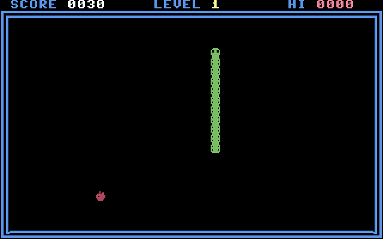

# Snake

A complete arcade Snake for the Commodore 64 in pure 6502 assembly — a custom
hires character set, deliberate colour on every cell it draws, `$CB` held-key
steering, SID effects with every write shadowed in RAM, nine levels that
speed the snake up and recolour it, a high score that survives the game, and
an explicit audit-and-improve loop that ran until every spec bullet passed.

`PROMPT.md` was drafted with Claude's help from human direction, and a human
edited the result. Every other file here — the sources, the plan they were
built from, the fidelity audit, the regression test, the evidence frames and
the packaged disk — was written by Claude Opus 5 in answer to that prompt.




## Play it

`snake.d64` sits beside the sources, so stock VICE is all you need:

```sh
x64sc -ntsc demos/snake/snake.d64
```

The `-ntsc` flag matters: given no video-standard flag, stock VICE boots the
PAL machine, and this game was built and tested on the NTSC machine
c64-tools boots by default — the whole speed curve is counted in 60ths of a
second. To rebuild the image (and the `.prg` beside it) from source:

```sh
c64 package demos/snake/snake.s -o demos/snake/snake.d64 --title "SNAKE"
```

**Controls.** Hold `W`/`A`/`S`/`D` to steer. Any key starts a game from the
title screen; `SPACE` plays again after a game over. Input is the matrix code
of the key held right now, read from `$CB` at the top of every tick, so
steering is continuous and does not wait on key repeat.

**Rules.** Eat apples to grow. Each apple is worth 10 points times the
current level, and every five apples the level goes up: the snake quickens
from 5 moves a second to 30, and changes colour so each level looks its own.
Hitting the border or your own body ends the game. Entering the cell your
tail is leaving *this* move does not.

## What is here

| File | |
|---|---|
| `PROMPT.md` | the human-directed, Claude-assisted prompt everything else answers |
| `PLAN.md` | the implementation plan written before any code |
| `AUDIT.md` | the three-iteration fidelity audit — every spec bullet, with evidence |
| `snake.s` | load address, BASIC stub, equates, the tick, the state machine, includes |
| `vars.s` | every mutable byte and every table, with the labels the tests read |
| `screen.s` | the cell pointer, text and digits without CHROUT, the screen clear |
| `chars.s` + `chars.inc` | the custom hires character set and its installer |
| `chars.txt` | ASCII art → `chars.inc` via `c64 charset encode --hires --first-code 112` |
| `play.s` | playfield, HUD, steering, the move, eating, levels, death, the high score |
| `title.s` | the block-letter title screen and the game-over panel |
| `sound.s` | three SID voices, every write shadowed in RAM |
| `test.yaml` | 101-step regression test: `c64 test run demos/snake/test.yaml` |
| `tools/evidence.sh` | re-runs the deterministic proof protocol and rewrites `evidence/` |
| `evidence/` | the frames that protocol captures, one per claim |
| `snake.d64` | the packaged disk image, autostartable in stock VICE |
| `snake.prg` | the assembled program `c64 package` writes beside the image |

## What a passing run shows

An assembled program with a BASIC SYS stub and a real game state machine
(title → play → game over → play again), `$CB` held-key steering, a custom
charset and deliberate colour across the title, border, snake, food and HUD,
SID sound effects with shadowed registers, and a jiffy-paced main loop that
quickens per level; then an audit in `AUDIT.md` with every spec bullet marked
pass, the deterministic evidence trail the prompt calls for — including a
second run whose game-over screen shows the surviving high score — a
`test.yaml` that passes under `c64 test run`, and a `snake.d64` the user can
autostart in stock VICE and play with W/A/S/D.

## The bit worth reading

`play.s`, and specifically what a move costs. The snake is a ring buffer of
**screen addresses**, so a move rewrites exactly three cells — erase the
tail, demote the old head to a body glyph, draw the new head — no matter how
long the snake is. Measured with `c64 profile` on the running machine, the
whole per-move update is **407 cycles**: 1.2% of the tightest tick the game
ever paces at. A 240-segment snake costs the same as a 3-segment one.

The second thing worth reading is the collision test, which is four
instructions. Nothing but spaces, an apple and the snake's own glyphs is ever
written inside the playfield, so "what am I about to hit?" is a read of one
screen code with three outcomes. That is deterministic under a debugger, it
names *what* was hit, and it needs no separate occupancy map to keep in step
with the screen.
